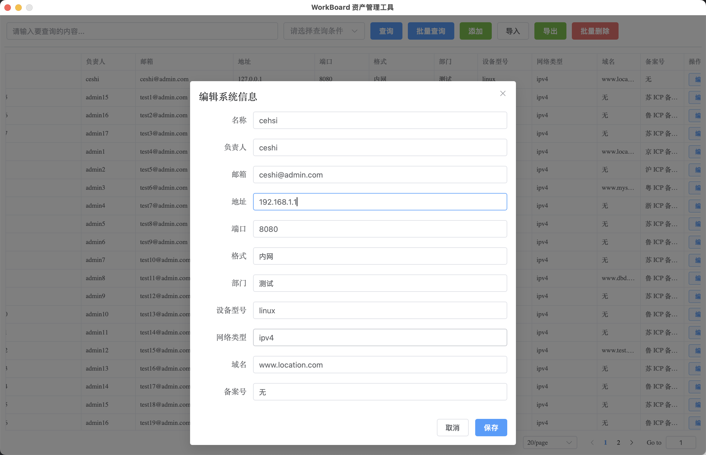

# rename.md

## 📖 简介 | Introduction
本项目基于 **Go (后端) + Vue (前端)** 开发，主要用于 **服务器信息管理**。  
功能包括：增删改查、批量导入、批量查询与导出，支持 Excel、CSV 格式文件。

This project is built with **Go (backend) + Vue (frontend)** for **Server Information Management**.  
It provides CRUD operations, batch import, batch search, and export, supporting Excel and CSV formats.
---

## 📑 字段映射 | Field Mapping

| 中文表头 (Excel/CSV) | English Label (Front-end) | 后端字段名 (Go Struct) | 说明 |  
|----------------------|----------------------------|-------------------------|------|  
| 名称                | Name                       | `name`                 | 系统/服务器名称 |  
| 负责人              | Owner                      | `owner`                | 负责人姓名 |  
| 邮箱                | Email                      | `email`                | 联系邮箱 |  
| 地址                | Address / IP               | `ip`                   | IP 地址 |  
| 端口                | Port                       | `port`                 | 服务端口 (1-65535) |  
| 格式                | Protocol                   | `protocol`             | 访问协议或服务格式 |  
| 部门                | Department                 | `department`           | 所属部门 |  
| 设备型号            | Device                     | `device`               | 服务器/设备型号 |  
| 网络类型            | Network                    | `network`              | 内网/公网/IPv4/IPv6 |  
| 域名                | Domain                     | `domain`               | 绑定域名 |  
| 备案号              | ICP Number                 | `icp_name`             | 工信部备案信息 |  

---

## 📂 导入文件要求 | Import File Requirements

1. **支持格式 / Supported Formats**
    - `.xls` (Excel 97-2003)
    - `.xlsx` (Excel 2007+)
    - `.csv` (UTF-8 编码)

2. **表头要求 / Header Requirements**
    - 必须包含 **11 列**，表头与上表对应。
    - 表头名称需与模板保持一致，否则会校验失败。

3. **示例表格 | Example Table**

导入文件格式错误，会自动输出模版。默认文件名：`服务器信息模板.xlsx`

---

## 📤 导出文件 | Export File
- 导出时会自动生成 **Excel 文件**，表头与导入模板保持一致。
- 默认文件名：`output.xlsx`
- 可在导出后使用 Excel/LibreOffice 打开。

---

## 🖼️ 前端界面示例 | Front-end UI Example

### 查询界面 | Search UI

### 编辑界面 | Edit UI

---

## ✅ 注意事项 | Notes
- **端口号** 必须为数字，范围 `1-65535`。
- **备案号** 字段允许为空，但如果存在，应与工信部格式一致（如：`苏 ICP 备 12345678 号`）。
- 导入文件时如果 **列数不对**，系统会提示错误并生成模板文件。  
